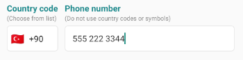

# rn-country-phone-picker

It's an international phone input with country selection and phone mask for React Native.

## New Version Information

This package is a fork of the original `react-native-intl-phone-input` with several modifications and improvements. We've made changes to enhance functionality, improve performance, and add new features. As a result, we're continuing with a new version under this new package name.



1. **Handling Default Country:**
    - The code now checks if a `defaultCountry` prop is provided. If not, it uses the country with code 'TR' as the default.
    - It initializes the state with the default country's details like dial code, flag, and mask.

2. **Input Mask and Phone Number Validation:**
    - The `onChangeText` function handles user input in the phone number field.
    - It counts the number of digits ('9') in the mask and validates the entered phone number length against the mask.
    - It calls the `onChangePropText` function to update the parent component with the formatted phone number and validation status.

3. **Country Selection Modal:**
    - The code updates the modal visibility based on the `disableCountryChange` prop. If `true`, the modal won't be shown.
    - Selecting a country in the modal updates the state with the selected country's details and calls the `onSelectCountry` prop function if provided.
    - In case of errors, it falls back to the default country.

4. **Country Filtering:**
    - The `filterCountries` function filters the list of countries based on the search term entered by the user.
    - It searches by country name, dial code, or code (uppercase).

5. **Minor UI Changes:**
    - The code removes some commented-out styles, likely for the border color of the country modal items.

#### This usage creates a visual component for users to select their country
```javascript
import CountryPhonePicker from "rn-country-phone-picker";

<CountryPhonePicker
  showCountryBox={true}  // Display the country selection box
  showInput={false}     // Hide the phone number input field
  phoneInputStyle={styles.selectBox}  // Style for the selection box
  containerStyle={styles.countryBox}  // Style for the entire country box
  flagStyle={styles.countryCode}      // Style for the country flag
  dialCodeTextStyle={styles.callingCode} // Style for the dial code text
  defaultCountry={countryCode}      // Set the default country based on `countryCode`
  lang={locale}                        // Set the language for country names based on `locale`
  filterText={I18n.t("countrySearchBoxPlaceholder", { locale })}  // Placeholder text for the country search box (localized)
  closeText={I18n.t("countrySearchBoxCloseText", { locale })}    // Text for the close button (localized)
  placeholder={I18n.t("countryBoxPlaceholder", { locale })}      // Placeholder text for the selection box (localized)
  onSelectCountry={onSelect}            // Callback function for country selection
/>
```

#### This usage creates a phone number input field where users can enter their phone number.
```javascript
<CountryPhonePicker
  showInput={true}        // Display the phone number input field
  showCountryBox={false}  // Hide the country selection box
  inputProps={{
    autoFocus: !!(callingCode && countryCode),  // Set auto-focus if dial code and country code are provided
    editable: !!(callingCode && countryCode),   // Enable editing only if dial code and country code are provided
  }}
  numberOfLines={1}        // Limit to a single line
  placeholder={I18n.t("phoneNumberPlaceholder", { locale })}  // Localized placeholder text (e.g., "Phone number")
  phoneInputStyle={styles.input}            // Style for the input field (using `styles`)
  defaultCountry={countryCode}      // Set the default country based on `countryCode`
  value={phoneNumber}          // Set the initial phone number value
  onChangeText={onChangeText}     // Callback function for phone number changes
/>
```

Overall, the changes improve the functionality and error handling of the `CountryPhonePicker` component. It provides a better user experience for entering and managing international phone numbers.


## Installation

Install the package via npm:

```
npm install rn-country-phone-picker
```

## Usage

Import the component:

```javascript
import CountryPhonePicker from 'rn-country-phone-picker';
```

Use the component:

```javascript
onChangeText = ({dialCode, unmaskedPhoneNumber, phoneNumber, isVerified}) => {
  console.log(dialCode, unmaskedPhoneNumber, phoneNumber, isVerified);
};

render() {
  return (
    <SafeAreaView>
      <CountryPhonePicker 
        onChangeText={this.onChangeText} 
        defaultCountry="TR" 
        renderAction={() => <Text>XX</Text>} 
      />
    </SafeAreaView>
  );
}
```

## Custom Modal Example

```javascript
renderCustomModal = (modalVisible, countries, onCountryChange) => (
  <Modal visible={modalVisible}>
    <SafeAreaView style={{ flex: 1 }}>
      <View>
        <View>
          <TextInput placeholder="Search" />
          <Text>🔍</Text>
        </View>
        <FlatList
          style={{ flex: 1 }}
          data={countries}
          keyExtractor={(item, index) => index.toString()}
          renderItem={({ item }) => (
            <TouchableWithoutFeedback onPress={() => onCountryChange(item.code)}>
              <Text>{item['your language code here for example tr']}</Text>
            </TouchableWithoutFeedback>
          )}
        />
      </View>
      <TouchableOpacity onPress={() => this.phoneInput.hideModal()}>
        <Text>CLOSE</Text>
      </TouchableOpacity>
    </SafeAreaView>
  </Modal>
)

render() {
  return (
    <CountryPhonePicker
      ref={(ref) => this.phoneInput = ref}
      customModal={this.renderCustomModal}
      defaultCountry="TR"
      lang="TR"
    />
  );
}
```

## Supported Languages

| Code | Language |
|------|----------|
| TR   | Turkish  |
| LT   | Lithuanian |
| EN   | English  |
| RU   | Russian  |

## Props

| Prop Name | Type | Default | Description |
|-----------|------|---------|-------------|
| lang | String | | Translate country name on modal |
| placeholder | String | | Phone input placeholder |
| defaultCountry | String | TR | Default country code |
| mask | String | | Custom mask for phone number |
| onChangeText | Function | | Callback when input text changes |
| customModal | Function | | Generate custom modal for country selection |
| phoneInputStyle | Style | | Style for the phone input TextInput |
| containerStyle | Style | | Style for the container |
| dialCodeTextStyle | Style | | Style for the dial code text |
| flagStyle | Style | | Style for the country flag |
| modalContainer | Style | | Style for the modal's SafeAreaView |
| filterInputStyle | Style | | Style for the filter input in modal |
| closeButtonStyle | Style | | Style for the close button text |
| modalCountryItemCountryNameStyle | Style | | Style for country names in modal |
| filterText | String | Filter | Placeholder text for filter input |
| closeText | String | CLOSE | Text for close button |
| disableCountryChange | Boolean | false | Disable country selection |
| renderAction | Function | | Render component to the right of phone input |
| placeholderTextColor | String | black | Color for placeholder text |

## Contributing

Contributions are welcome! Please feel free to submit a Pull Request.

## License

This project is licensed under the MIT License.